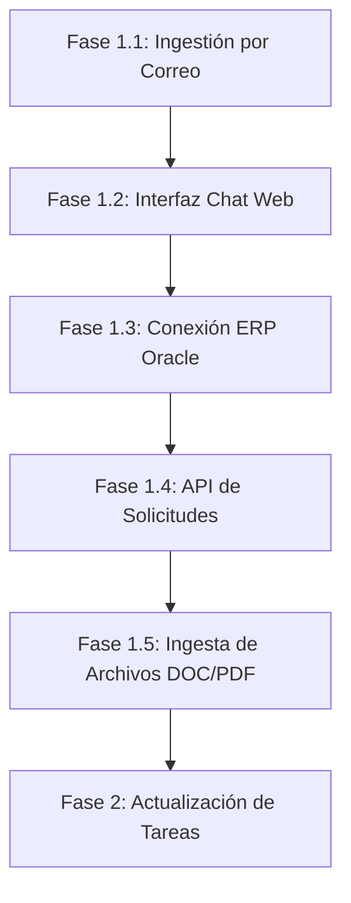

# Portal de Seguimiento Dovela - Especificación de Requerimientos y Prompt para Agente de IA

Este documento define las especificaciones funcionales, técnicas y la estructura modular para el desarrollo del **Portal de Seguimiento de DOVELA**, a partir de los requerimientos iniciales de negocio. Asimismo, incluye el **Prompt estructurado** listo para que un Agente de IA comience el desarrollo del primer módulo (**Fase 1.1: Ingestión de Solicitudes por Correo Electrónico**).

---

## 1. Contexto y Objetivos del Proyecto

### 1.1 ¿Qué es DOVELA?
DOVELA es un Proveedor Autorizado de Certificación (PAC) que ofrece portales de facturación (CFDI) conectados al SAT, desarrollo de software a la medida y mantenimiento de sistemas legados. Está compuesto por 5 equipos operativos:
1. Fábrica de Software.
2. Implementación.
3. Mesa de Ayuda.
4. Infraestructura.
5. Sysadmins & DBAs.

### 1.2 Objetivo del Portal
Gestionar, controlar y dar seguimiento a las tareas y requerimientos solicitados a DOVELA. Hoy en día se opera en formularios de Oracle APEX. Se busca evolucionar la creación de requerimientos, tareas y comentarios a una experiencia guiada por chat, automatizaciones e integraciones (correo, API, ERP, archivos).

---

## 2. Stack Tecnológico y Arquitectura

Para permitir la escalabilidad y la distribución física de servidores en ambientes de TEST y PRODUCCIÓN, el proyecto se estructurará de la siguiente manera:

*   **Frontend:** Aplicación web independiente.
*   **Backend:** API independiente desarrollada en **Python** (ej. FastAPI/Flask) que procesa las solicitudes, lógica de negocio e integraciones.
*   **Base de Datos (Persistencia):** Oracle Database (diseño desacoplado para facilitar cambio de instancia mediante configuración externa).
*   **Despliegue:** Contenedores independientes para Frontend y Backend utilizando `docker-compose`.
*   **Almacenamiento (NFS):**
    *   `/NFS/adjuntos/` - Carpeta para archivos adjuntos de correos o chats.
    *   `/NFS/Archivos_MD/` - Carpeta para documentos estructurados de requerimiento (`.md`).

---

## 3. Plan de Implementación Modular

El desarrollo se realizará de forma incremental en las siguientes fases:



*   **Fase 1.1:** Lectura de correos, parsing, mapeo de clientes, almacenamiento NFS y generación de ficheros `.md`. **(Fase actual)**
*   **Fase 1.2:** Chat Web interactivo para registrar solicitudes.
*   **Fase 1.3:** Sincronización automática con la base de datos Oracle del ERP (Mesa de Ayuda).
*   **Fase 1.4:** API Rest pública para creación externa de solicitudes.
*   **Fase 1.5:** Carga e importación de requerimientos en archivos físicos (.txt, .md, .docx, .pdf).
*   **Fase 2:** Actualización y seguimiento de tareas asignadas (por recursos) desde Correo, Chat, API o Portal.

---

## 4. Detalle Técnico de la Fase 1.1: Ingestión de Solicitudes por Correo

Esta fase consiste en un servicio en el Backend que escuche un buzón de correo electrónico y realice los siguientes procesos automáticamente:

1.  **Filtro de Entrada:** Identifica correos cuyo asunto contenga el texto `"Nueva solicitud"`.
2.  **Procesamiento y Extracción de Datos:**
    *   **Solicitante:** Dirección de correo del remitente.
    *   **Tipo:** Inicializado como `"Nuevo"`.
    *   **Estatus:** Inicializado como `"En espera"`.
    *   **Prioridad:** Se inicializa como vacía/nula (definida posteriormente por Dirección).
    *   **Cliente:** Se extrae del cuerpo o metadatos del correo. Se busca en el catálogo de la tabla `Clientes`. Si no existe, se registra el nuevo cliente de forma automática.
    *   **Nombre de la solicitud (Asunto/Resumen):** Generar un título sintetizado a partir del correo (ej. *"Creación de nuevo reporte gastos"*).
    *   **Descripción mejorada:** Limpieza y mejora de la redacción del cuerpo del correo original usando técnicas de procesamiento de texto/IA.
3.  **Gestión de Adjuntos:**
    *   Si el correo incluye archivos adjuntos, se guardan físicamente en el directorio NFS configurado.
    *   Se inserta el registro en la tabla intermedia `Solicitudes_Adjuntos`.
4.  **Generación de Documento de Requerimiento (.md):**
    *   Se genera un archivo `.md` estandarizado con la ficha de la solicitud (Datos generales, descripción, objetivos, etc.).
    *   Se almacena en el directorio NFS `/NFS/Archivos_MD/`.
    *   Se registra el path del archivo en la tabla intermedia `Solicitudes_MD`.

---

## 5. PROMPT PARA EL AGENTE DE IA (COPIAR Y PEGAR)

*Copia el siguiente prompt y utilízalo para iniciar una nueva sesión de desarrollo con tu Agente de IA para arrancar el proyecto:*

```markdown
Hola. Vamos a iniciar el desarrollo del "Portal de Seguimiento DOVELA". Es un sistema diseñado para gestionar requerimientos de software y tareas internas de los equipos de tecnología (Fábrica, Soporte, DBAs, Infraestructura).

El stack tecnológico inicial consistirá en:
- Backend: Python (utilizando un framework como FastAPI o Flask, ideal para servicios ligeros, APIs y procesamiento asíncrono).
- Base de datos: Oracle Database (las credenciales y host se definirán por variables de entorno).
- Estructura: Backend y Frontend en directorios separados.
- Despliegue: Docker y Docker Compose para levantar el backend y base de datos local de pruebas.

Quiero comenzar estrictamente con el **Módulo 1.1: Ingestión de Solicitudes por Correo Electrónico**.

### Objetivo de esta tarea:
Desarrollar el servicio backend (o worker) encargado de leer correos electrónicos entrantes y registrar solicitudes automáticamente.

### Instrucciones y Flujo de Trabajo:
1. **Conexión al Correo:** Configurar un listener/polling de correo (IMAP/SMTP o Microsoft Graph/Gmail API) para detectar correos entrantes que contengan "Nueva solicitud" en el asunto.
2. **Procesamiento del Contenido:**
   - **Remitente:** Extraer el email como Solicitante.
   - **Cliente:** Identificar el cliente en el contenido. Buscar en la tabla `Clientes`. Si no existe, insertarlo en la BD.
   - **Campos por Defecto:** Tipo = 'Nuevo', Estatus = 'En espera', Prioridad = NULL.
   - **Descripción:** Extraer el cuerpo del correo, limpiar el formato HTML/texto plano y opcionalmente refinar la redacción (dejando el original como historial).
   - **Título:** Sintetizar el asunto del correo para generar un título claro de la solicitud.
3. **Persistencia en Base de Datos Oracle:**
   - Diseña e implementa el script DDL de creación de tablas necesario para este módulo: `Clientes`, `Solicitudes`, `Adjuntos`, `Solicitudes_Adjuntos`, `Solicitudes_MD`.
   - Asegúrate de usar sentencias SQL compatibles con Oracle DB.
4. **Manejo de Archivos Adjuntos (NFS):**
   - Si el correo incluye adjuntos, guardarlos en un directorio local configurable (que simulará el NFS) y registrar las rutas en la tabla `Adjuntos` y la relación en `Solicitudes_Adjuntos`.
5. **Generación del Archivo de Requerimientos (.md):**
   - Por cada solicitud, crea un archivo `.md` estandarizado que sirva como plantilla de diseño/estimación.
   - Guarda este archivo en el directorio configurado para archivos MD y guarda el registro en la BD.
6. **Dockerización:**
   - Crea el `Dockerfile` para este servicio de backend.
   - Crea un archivo `docker-compose.yml` que levante el Backend y configure las variables de entorno necesarias para la conexión IMAP y Oracle DB.

### Entregables esperados:
- Estructura de directorios organizada (ej. `/backend`).
- Script SQL/DDL compatible con Oracle DB para crear las tablas del Módulo 1.1.
- Código fuente documentado del servicio de lectura, parsing y persistencia de correos.
- Plantilla estándar de documento de requerimientos `.md`.
- `Dockerfile` y `docker-compose.yml` configurados.
- Instrucciones en un archivo `README.md` sobre cómo configurar las credenciales de correo y base de datos para probar localmente.

Por favor, diseña la estructura del proyecto y propón el modelo de base de datos relacional inicial antes de comenzar a escribir el código del lector de correos.
```

---

## 6. Siguientes Pasos
Una vez que el Agente de IA complete la Fase 1.1, se procederá a:
1. Proporcionar las credenciales de la base de datos Oracle o el script de conexión correspondiente.
2. Iniciar la Fase 1.2 (Chat Web) conectando la interfaz frontend al backend ya estructurado.
