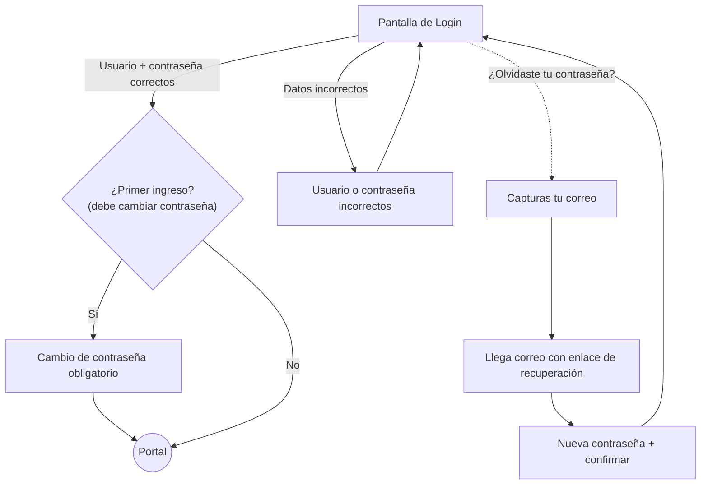
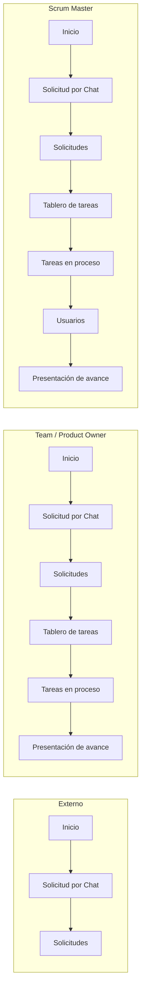
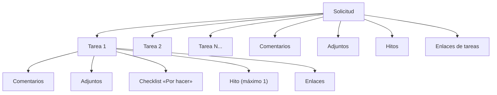
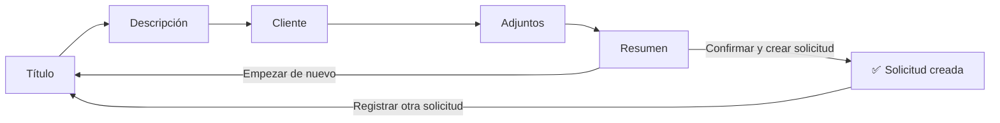
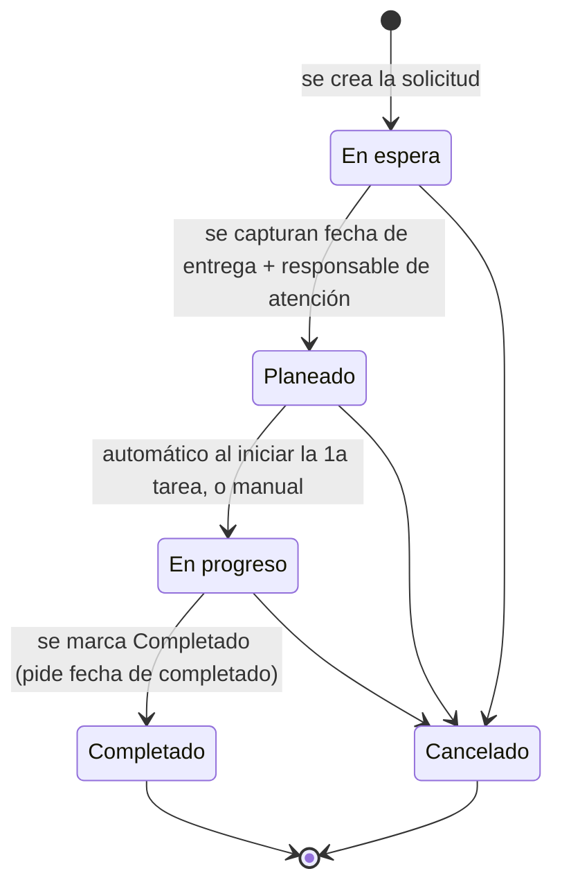
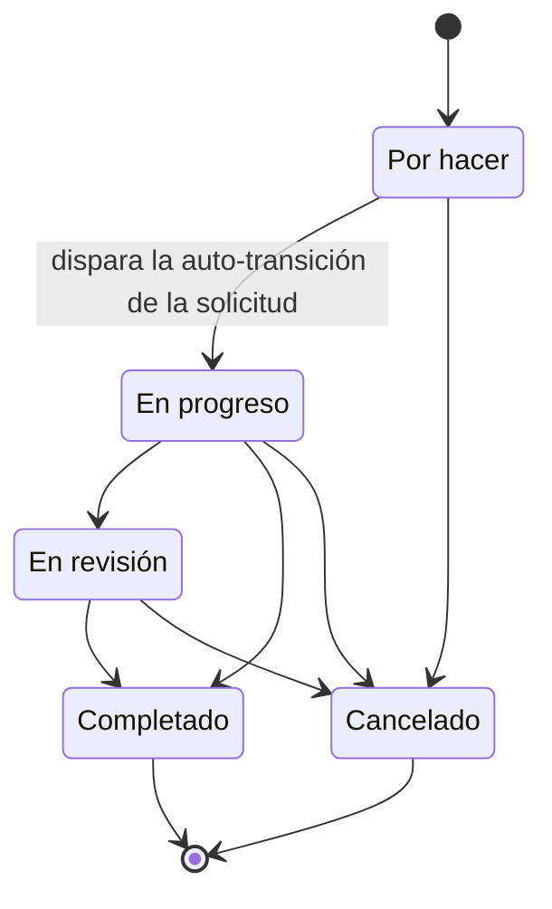

# Manual de Usuario — Portal de Seguimiento DOVELA

> Guía completa de uso del Portal DOVELA para los 4 perfiles del sistema: **Externo**,
> **Team**, **Scrum Master** y **Product Owner**. Este documento describe qué puede hacer
> cada perfil, paso a paso, con los nombres exactos de botones y campos tal como aparecen en
> el portal.

---

## Tabla de contenido

1. [¿Qué es el Portal DOVELA?](#1-qué-es-el-portal-dovela)
2. [Los 4 perfiles del sistema](#2-los-4-perfiles-del-sistema)
3. [Acceso al portal](#3-acceso-al-portal)
4. [Navegación general](#4-navegación-general)
5. [Página Inicio](#5-página-inicio)
6. [Solicitudes](#6-solicitudes)
7. [Tareas](#7-tareas)
8. [Tablero de tareas (Kanban)](#8-tablero-de-tareas-kanban)
9. [Tareas en proceso (carga del equipo)](#9-tareas-en-proceso-carga-del-equipo)
10. [Presentación de avance](#10-presentación-de-avance)
11. [Notificaciones](#11-notificaciones)
12. [Menciones @ en comentarios](#12-menciones--en-comentarios)
13. [Módulo de Usuarios (solo Scrum Master)](#13-módulo-de-usuarios-solo-scrum-master)
14. [Matriz de permisos por perfil](#14-matriz-de-permisos-por-perfil)
15. [Glosario](#15-glosario)

---

## 1. ¿Qué es el Portal DOVELA?

Es el sistema donde se registran, dan seguimiento y reportan las **solicitudes** que el
equipo recibe (de clientes internos o externos) y las **tareas** en las que se descompone
cada solicitud para atenderla. Permite:

- Registrar una solicitud por **chat** (conversación guiada) o por **formulario**.
- Ver el estado de todas las solicitudes y tareas, filtrarlas y darles seguimiento.
- Organizar el trabajo del equipo en un **tablero tipo Kanban** (arrastrar tarjetas entre
  columnas de estatus).
- Ver, por área, quién del equipo está trabajando en qué (**Tareas en proceso**).
- Ver indicadores gerenciales de avance por cliente, tipo de solicitud y área
  (**Presentación de avance**).
- Recibir notificaciones cuando te asignan algo, te mencionan en un comentario, o te quedas
  sin trabajo asignado.

## 2. Los 4 perfiles del sistema

| Perfil | ¿Quién es? | Resumen de lo que puede hacer |
|---|---|---|
| **Externo** | Un solicitante que no es parte del equipo interno (p. ej. un cliente) | Solo crea y ve **sus propias** solicitudes, y comenta en ellas. No ve tareas, tablero, ni reportes. |
| **Team** | Miembro del equipo que ejecuta el trabajo | Todo lo de Externo, más: ver/gestionar tareas de todas las solicitudes, el Tablero, "Tareas en proceso" y "Presentación de avance". Puede crear/asignar tareas solo en las solicitudes donde es el **responsable de atención**. |
| **Scrum Master** | Administrador operativo del equipo | Todo lo de Team, más: gestionar el módulo de **Usuarios**, crear/asignar tareas en **cualquier** solicitud, editar o borrar el comentario/hito/"por hacer" de cualquier persona, y borrar solicitudes y tareas. |
| **Product Owner** | Rol gerencial/de negocio | Todo lo de Team, pero por *default* ve **todas** las solicitudes y tareas (no solo las propias) en las vistas de listado. No tiene el módulo de Usuarios. |

Un mismo perfil puede además ser el **responsable de atención** de una solicitud puntual (la
persona encargada de que esa solicitud avance) sin importar su rol Scrum — ese rol adicional
le da permiso de crear y asignar tareas dentro de esa solicitud en particular, igual que a un
Scrum Master.

## 3. Acceso al portal

### 3.1 Iniciar sesión

En la pantalla de **Iniciar sesión**, captura:

- **Usuario** (formato `DOVELA_XX`)
- **Contraseña**

y presiona **Entrar**. Si el usuario o la contraseña son incorrectos, el portal siempre
muestra el mismo mensaje genérico *"Usuario o contraseña incorrectos"* (por seguridad, nunca
indica cuál de los dos datos falló, ni si la cuenta no existe o está desactivada).

### 3.2 ¿Olvidaste tu contraseña?

Desde el enlace **¿Olvidaste tu contraseña?** en la pantalla de login:

1. Captura tu **correo electrónico** y presiona **Enviar enlace de recuperación**.
2. El portal siempre responde *"Si el correo está registrado, se envió un enlace de
   recuperación"* (no confirma si el correo existe, por seguridad).
3. Si el correo sí está registrado y tiene acceso activo, te llega un correo con un enlace de
   recuperación. Ese enlace es válido por tiempo limitado.
4. Al abrir el enlace, captura **Nueva contraseña** y **Confirmar nueva contraseña** (mínimo 8
   caracteres, deben coincidir) y presiona **Restablecer contraseña**.
5. Si el enlace ya expiró o ya fue usado, verás *"El enlace de recuperación no es válido o ya
   expiró"* — deberás solicitar uno nuevo.
6. Al terminar, un botón **Ir a iniciar sesión** te regresa al login.

### 3.3 Cambio de contraseña obligatorio (primer ingreso)

Cuando el Scrum Master te da de alta y te otorga acceso, te asigna una **contraseña inicial**.
La primera vez que inicias sesión con ella, el portal te obliga a cambiarla antes de dejarte
usar cualquier otra pantalla: verás el aviso *"Debes cambiar tu contraseña antes de
continuar"*, con campos para la contraseña actual (la temporal) y la nueva (+ confirmación).
No hay botón de "Cancelar" en esta pantalla — es obligatorio completarla.

### 3.4 Cambiar tu contraseña cuando quieras

En la parte superior del portal (con sesión iniciada) siempre hay un botón **Cambiar
contraseña**. Pide tu contraseña actual + la nueva + confirmación, y sí tiene botón
**Cancelar**. Si te equivocas en la contraseña actual, verás *"La contraseña actual no es
correcta"* (no se cierra tu sesión).

### 3.5 Diagrama del flujo de acceso

## 4. Navegación general

### 4.1 Elementos siempre visibles

- **☰** (arriba a la izquierda): muestra/oculta el menú lateral. Tu preferencia se recuerda la
  próxima vez que entres.
- **🔔 Notificaciones**: ver [sección 11](#11-notificaciones).
- **Cambiar contraseña**: ver [3.4](#34-cambiar-tu-contraseña-cuando-quieras).
- **🌙 / ☀️ Tema**: alterna entre modo claro y oscuro. Está disponible incluso antes de iniciar
  sesión.
- Al pie del menú lateral: tu nombre completo, tu rol, y el botón **Cerrar sesión**.

### 4.2 Menú lateral por perfil

| Opción del menú | Externo | Team | Scrum Master | Product Owner |
|---|:---:|:---:|:---:|:---:|
| Inicio | ✅ | ✅ | ✅ | ✅ |
| Solicitud por Chat | ✅ | ✅ | ✅ | ✅ |
| Solicitudes | ✅ | ✅ | ✅ | ✅ |
| Tablero de tareas | ❌ | ✅ | ✅ | ✅ |
| Tareas en proceso | ❌ | ✅ | ✅ | ✅ |
| Usuarios | ❌ | ❌ | ✅ | ❌ |
| Presentación de avance | ❌ | ✅ | ✅ | ✅ |

## 5. Página Inicio

Al entrar, siempre ves un saludo *"Bienvenido, {tu nombre}"* y dos botones: **Registrar
solicitud por chat** y **Ver solicitudes existentes**. Debajo, un panel de indicadores que
cambia según tu perfil (solo lectura, no clicable):

- **Externo**: un solo bloque, **Mis solicitudes** (total, por prioridad, por estatus).
- **Team**: tres bloques — **Mis solicitudes** (donde eres solicitante), **Solicitudes que
  atiendo** (donde eres responsable de atención), y **Mis tareas** (donde eres responsable de
  la tarea).
- **Scrum Master / Product Owner**: tres bloques con la vista completa del equipo —
  **Solicitudes totales**, **Tareas totales**, y **Solicitudes por área**.

## 6. Solicitudes

Una **solicitud** es el registro de una necesidad o petición de trabajo. Cada solicitud puede
tener una o varias **tareas**, además de comentarios, adjuntos, hitos y enlaces asociados.

### 6.1 Crear una solicitud por Chat

Es una conversación guiada paso a paso con el asistente del portal:

1. **Título**: un título breve de la solicitud.
2. **Descripción**: el detalle de qué necesitas.
3. **Cliente**: busca uno existente o escribe uno nuevo; también puedes saltarte este paso
   (queda como "Definir después").
4. **Adjuntos**: opcional, uno o varios archivos, o continuar sin adjuntar.
5. **Resumen**: se muestra tu correo, título, descripción, cliente y adjuntos elegidos.
   Botones **Confirmar y crear solicitud** o **Empezar de nuevo**.
6. Al confirmar, el asistente responde: *"Listo. Creé la solicitud #&lt;número&gt;: "&lt;título&gt;"
   (estatus: &lt;estatus&gt;)."*, y puedes presionar **Registrar otra solicitud** para volver a
   empezar.

Tu correo se toma automáticamente de tu cuenta — no se pide.

### 6.2 Crear una solicitud por formulario

Desde **Solicitudes**, botón **Crear solicitud**, se abre un formulario cuyos campos varían
según tu perfil:

| Campo | Externo | Team / Scrum Master / Product Owner |
|---|:---:|:---:|
| Título (obligatorio) | ✅ | ✅ |
| Descripción (obligatoria) | ✅ | ✅ |
| Tipo (obligatorio) | ✅ | ✅ |
| Cliente (opcional) | ✅ | ✅ |
| Adjuntos (opcional) | ✅ | ✅ |
| Solicitante | tu propio correo, automático | select de miembros |
| Canal (obligatorio, default "Formulario") | — | ✅ |
| Prioridad (1-5, default 3 - Media) | — | ✅ |
| SR de EBS (opcional) | — | ✅ |

Un Externo **sí puede crear solicitudes**, con un formulario reducido (sin Solicitante,
Canal, Prioridad ni SR de EBS visibles).

### 6.3 Listado de Solicitudes

Filtros disponibles:

- **Cliente** (texto libre)
- **Nombre de la solicitud** (texto libre)
- **Área del responsable** (texto libre)
- **Estatus** (select, "Todos los estatus" + catálogo)
- **Ordenar por**: Más recientes / Estatus / Tipo / Cliente / Orden de prioridad

Además, un toggle **Ver: Mis solicitudes** / **Ver: Todas** (no aplica a Externo, que solo ve
las suyas siempre). "Mis solicitudes" incluye aquellas donde eres solicitante, responsable de
atención, o responsable de alguna de sus tareas.

**Por defecto**, solo **Product Owner** arranca viendo "Todas" — Team y Scrum Master arrancan
en "Mis solicitudes" (cada quien puede cambiarlo manualmente en cualquier momento).

Cada solicitud se muestra en una tarjeta con: nombre, Cliente, Tipo, Solicitante,
Responsable (+ área, si tiene), un badge de **Prioridad**, un badge de **Vencimiento** (si
tiene fecha de entrega), el estatus, y la fecha de creación.

### 6.4 Detalle de una solicitud

Muestra: nombre, estatus, Descripción, Cliente, Tipo, Solicitante, Canal, **SR de EBS** (si
tiene), Prioridad, **Responsable de atención + su área** (si está asignado), **Fecha de
entrega** (con semáforo de vencimiento), **Fecha Completado** (si aplica), y fecha de creación.

**Botones del encabezado**:
- **Editar Solicitud** — visible siempre para todo perfil que no sea Externo. Un Externo solo
  puede editar mientras la solicitud está en estatus **En espera** (verá el mensaje *"Solo
  puedes editar la solicitud mientras está En espera."* en cualquier otro estatus).
- **Borrar Solicitud** — solo Scrum Master.

**Pestañas** (con contador cada una):

| Pestaña | Visible para |
|---|---|
| Adjuntos | Todos |
| Tareas | Todos menos Externo |
| Comentarios | Todos |
| Hitos | Todos menos Externo |
| Enlaces de tareas | Todos menos Externo |

- **Editar** (no-Externo): Título, Descripción, Tipo, Canal, Prioridad, Estatus, Fecha
  Completado (obligatoria si el estatus es Completado), Fecha de entrega + Responsable de
  atención (**obligatorios desde el estatus Planeado en adelante**), Cliente, SR de EBS.
- **Editar (Externo)**: solo Título, Descripción, Tipo y Cliente.
- **Tareas**: el botón **Agregar Tarea** solo aparece si eres Scrum Master **o** el
  responsable de atención de esa solicitud (de lo contrario verás: *"Solo el Scrum Master o
  el responsable de atención de la solicitud pueden agregar tareas."*). Borrar una tarea
  individual: solo Scrum Master.
- **Comentarios**: cualquier perfil puede comentar (incluido Externo), con soporte de
  @menciones — aquí **sí se puede mencionar a un Externo**.
- **Hitos**: crear/editar/borrar requiere no ser Externo; editar/borrar además requiere ser el
  autor del hito o Scrum Master.
- **Enlaces de tareas**: lista de enlaces asociados a las tareas de la solicitud (mismas
  reglas de visibilidad que Tareas/Hitos).
- **Adjuntos**: lista de archivos con botón **Descargar** por archivo; sección para agregar
  más adjuntos con botón **Subir adjuntos**. Límite general de adjuntos en todo el portal:
  **máximo 5 archivos por lote, máximo 10 MB cada uno**.

### 6.5 Ciclo de vida de una solicitud

> **Auto-transición importante**: en cuanto la primera tarea de una solicitud pasa de "Por
> hacer" a "En progreso" (ya sea arrastrándola en el Tablero o editándola), la solicitud
> **pasa sola** a estatus "En progreso" — no hace falta editarla manualmente. Esto solo ocurre
> si la solicitud seguía en "Planeado"; si ya estaba en otro estatus, no pasa nada.

### 6.6 Prioridad (escala 1-5)

| Nivel | Etiqueta | Cuándo usarlo |
|:---:|---|---|
| 1 | **Crítica** | Bloqueo total, caída de servicio, falla de seguridad. Detiene el sprint activo. |
| 2 | **Alta** | Funcionalidad clave afectada sin solución alterna viable. |
| 3 | **Media** (default) | Historias/solicitudes estándar del backlog regular. |
| 4 | **Baja** | Mejoras menores, deuda técnica no urgente. |
| 5 | **Trivial** | Sugerencias o ideas a futuro, sin impacto de negocio. |

## 7. Tareas

Cada solicitud se descompone en **tareas** concretas asignadas a un miembro del equipo.

### 7.1 Quién puede crear, editar y borrar tareas

| Acción | Quién puede |
|---|---|
| Crear una tarea | Scrum Master, o el **responsable de atención** de esa solicitud |
| Editar una tarea | Cualquier perfil que no sea Externo |
| Borrar una tarea | Solo Scrum Master |
| Ser responsable de una tarea | Cualquier miembro interno — **nunca** un Externo |

### 7.2 Campos de una tarea

Título (obligatorio), Descripción, Responsable (o "Sin asignar"), Estado, Fecha de inicio /
Fecha de fin **planeadas** (si se dejan vacías al crear, la tarea arranca hoy y vence en 7
días), Fecha de inicio / Fecha de fin **reales**, Horas estimadas, Horas reales. Al crear una
tarea también puedes agregar adjuntos desde el mismo formulario.

Si asignas un responsable al crear la tarea, esa persona recibe una notificación.

### 7.3 Pestañas del detalle de una tarea

| Pestaña | Qué es |
|---|---|
| Adjuntos | Subir/descargar archivos de la tarea |
| Por hacer | Checklist propio de la tarea (ver 7.4) |
| Hito | Un único hito por tarea (máximo 1) |
| Comentarios | Con @menciones (ver sección 12) |
| Enlaces | Referencias externas (URL, ID/página de la aplicación en el sistema legado) — **no se pueden editar ni borrar** una vez creadas |

### 7.4 Checklist "Por hacer"

Cada ítem tiene Nombre, Descripción (opcional) y Responsable (opcional). El checkbox de
completado y los botones Editar/Borrar de un ítem **solo los puede usar quien lo creó, o el
Scrum Master** — si asignas el ítem a otra persona, ella no puede marcarlo si no fue quien lo
creó.

### 7.5 Ciclo de vida de una tarea

## 8. Tablero de tareas (Kanban)

Vista de tarjetas organizadas en 5 columnas (una por cada estatus de tarea): **Por hacer**,
**En progreso**, **En revisión**, **Completado**, **Cancelado**. Cada columna muestra un
contador de tareas.

### 8.1 Arrastrar y soltar

Arrastra una tarjeta de una columna a otra para cambiar su estatus. Al soltarla, el portal
guarda el cambio automáticamente. Si el guardado falla por algún motivo, la tarjeta regresa
sola a su columna original.

### 8.2 Filtros (5)

| # | Filtro | Tipo | Qué hace |
|---|---|---|---|
| 1 | **Fecha inicio** | Fecha | Límite inferior — junto con Fecha fin, delimita cuándo se completó realmente una tarea |
| 2 | **Fecha fin** | Fecha | Límite superior. **Ambas fechas solo aplican a tareas en estatus Completado** — el resto (Por hacer, En progreso, En revisión) siempre se muestra, sin importar el rango. Default: los últimos 8 días hasta hoy |
| 3 | **Área** | Select, "Todas las áreas" | Filtra por el área/perfil del responsable de la tarea |
| 4 | **Responsable** | Select, "Todos los responsables" | La lista de opciones queda acotada al área elegida en el filtro anterior |
| 5 | **Cliente** | Select, "Todos los clientes" | Filtra por el cliente de la solicitud dueña de la tarea |

**Por defecto**: Product Owner ve "Todos los responsables"; Scrum Master y Team arrancan
viendo solo sus propias tareas asignadas.

> Si llegas al Tablero desde un enlace de "Tareas en proceso" (ver sección 9), el filtro de
> Responsable llega ya preseleccionado con esa persona.

## 9. Tareas en proceso (carga del equipo)

Muestra, agrupada por **área**, una tabla con cada miembro Team/Scrum Master de esa área y
hasta 3 de sus tareas activas ("Tarea 1", "Tarea 2", "Tarea 3"): primero las que están **En
progreso**, luego las **Por hacer**, ordenadas por prioridad y fecha de inicio planeada. Un
miembro sin tareas activas también aparece, con las celdas vacías. Product Owner no aparece
como fila (solo puede ver la vista, no es parte del equipo de ejecución).

- **Refresco**: automático cada 5 minutos + botón **Actualizar ahora**, con la leyenda de
  "Última actualización".
- Clic en el nombre de un miembro → te lleva al **Tablero de tareas** ya filtrado por esa
  persona.
- Clic en una de sus tarjetas de tarea → te lleva al **detalle de esa tarea**.
- **Notificación automática**: cada 10 minutos, el sistema revisa quién se quedó sin ninguna
  tarea "En progreso" asignada y le notifica una sola vez (no te satura repitiendo el aviso
  mientras la situación no cambie); en cuanto vuelves a tener una tarea En progreso, se borra
  esa marca y podrías recibir el aviso de nuevo si te vuelves a quedar sin trabajo activo.

## 10. Presentación de avance

Vista de indicadores gerenciales, visible para todo el equipo interno (Team, Scrum Master,
Product Owner) — **no** para Externo.

### 10.1 Filtros

- **Fecha inicio / Fecha fin**: por defecto, del primer día del mes actual a hoy.
- **Área responsable**: select, "Todas" + catálogo de áreas — filtra por el área/perfil del
  responsable de atención de la solicitud.

### 10.2 Contenido

- **3 mosaicos** arriba (clicables, abren el detalle de esa métrica): **Solicitudes en
  proceso**, **Solicitudes concluidas**, **Nuevas solicitudes**.
- **Por cliente**: En proceso / Concluidas / Nuevas / En espera (solo cuenta solicitudes).
- **Por tipo de solicitud**: igual formato, incluye también el desglose de tareas.
- **Por área**: mismas 4 columnas de solicitudes que "Por cliente" (agrupado por el área del
  solicitante).
- **Solicitudes por estatus**: conteo por cada estatus del catálogo.

### 10.3 Detalle de una métrica

Al hacer clic en uno de los 3 mosaicos, ves: el total de esa métrica, dos gráficas de pastel
(Por cliente, Por área), y una tabla de solicitudes con columnas **Nombre de la solicitud**
(es un enlace, te lleva directo al detalle de esa solicitud), Cliente, Fecha de solicitud,
Solicitante y Responsable.

## 11. Notificaciones

El ícono 🔔 (siempre visible con sesión iniciada) muestra un contador de notificaciones no
leídas (hasta "99+"). Al hacer clic se abre un panel con la lista de notificaciones y, si hay
alguna sin leer, el botón **Marcar todas como leídas**.

Al hacer clic en una notificación individual, se marca como leída y te lleva directo a la
tarea o solicitud relacionada.

| Tipo de notificación | Cuándo se dispara |
|---|---|
| Mención en comentario | Alguien te arrobó (`@tu_usuario` o `@todos`) en un comentario |
| Tarea asignada | Te asignaron como responsable de una tarea |
| Solicitud asignada | Te asignaron como responsable de atención de una solicitud |
| "Por hacer" asignado | Te asignaron un ítem del checklist de una tarea |
| Sin tarea en progreso | Te quedaste sin ninguna tarea "En progreso" activa (ver [sección 9](#9-tareas-en-proceso-carga-del-equipo)) |

## 12. Menciones @ en comentarios

Al escribir `@` seguido de texto (sin espacio) dentro de un comentario, aparece un menú con
**@todos** (todo el equipo) más los miembros que coincidan con lo que escribiste. Usa las
flechas ↑/↓ para navegar, **Enter** para elegir, y **Escape** para cerrar el menú.

- En comentarios **de tarea**, un Externo **nunca** puede ser mencionado (ni directo ni dentro
  de "@todos").
- En comentarios **de solicitud**, un Externo **sí** puede ser mencionado.

## 13. Módulo de Usuarios (solo Scrum Master)

Tabla con Nombre, Usuario, Rol Scrum y Acceso ("Activo"/"Sin acceso"), con botones por fila:
**Editar usuario** (si ya tiene acceso) u **Otorgar acceso** (si no), y **Dar de baja**.

- **Crear usuario** (botón superior): pide Usuario, Nombre completo y Correo (opcional). Solo
  da de alta el registro del miembro — todavía sin rol, sin contraseña, sin poder entrar al
  portal (queda "Sin acceso").
- **Otorgar acceso**: pide Rol Scrum + Contraseña inicial (mínimo 8 caracteres). Esa persona
  quedará obligada a cambiarla en su primer ingreso (ver [3.3](#33-cambio-de-contraseña-obligatorio-primer-ingreso)).
- **Editar usuario** (ya activo): permite cambiar Usuario, Nombre completo, Correo, Rol Scrum,
  Acceso (Activo/Desactivado), y opcionalmente asignar una **Nueva contraseña** sin pedirle la
  anterior.
- **Dar de baja**: pide confirmación (*"¿Seguro que quieres dar de baja a X? Dejará de
  aparecer en Usuarios y en los selectores de solicitante/responsable, y perderá el acceso al
  portal."*). Es una baja lógica — no borra el historial de esa persona en el sistema.

## 14. Matriz de permisos por perfil

| Acción | Externo | Team | Scrum Master | Product Owner |
|---|:---:|:---:|:---:|:---:|
| Crear solicitud (chat o formulario) | ✅ | ✅ | ✅ | ✅ |
| Ver solo sus propias solicitudes / todas | solo propias | propias por default | propias por default | **todas** por default |
| Editar una solicitud | solo si está "En espera" | ✅ | ✅ | ✅ |
| Borrar una solicitud | ❌ | ❌ | ✅ | ❌ |
| Comentar en una solicitud | ✅ | ✅ | ✅ | ✅ |
| Ser mencionado en comentario de solicitud | ✅ | ✅ | ✅ | ✅ |
| Ver/gestionar Tareas, Hitos, Enlaces de una solicitud | ❌ | ✅ | ✅ | ✅ |
| Crear/asignar una tarea | ❌ | solo si es responsable de atención | ✅ (cualquier solicitud) | solo si es responsable de atención |
| Editar una tarea | ❌ | ✅ | ✅ | ✅ |
| Borrar una tarea | ❌ | ❌ | ✅ | ❌ |
| Ser responsable de una tarea | ❌ nunca | ✅ | ✅ | ✅ |
| Ser mencionado en comentario de tarea | ❌ nunca | ✅ | ✅ | ✅ |
| Editar/borrar comentario, hito o "por hacer" ajeno | ❌ | ❌ | ✅ | ❌ |
| Ver Tablero de tareas | ❌ | ✅ | ✅ | ✅ |
| Ver "Tareas en proceso" | ❌ | ✅ | ✅ | ✅ |
| Ver "Presentación de avance" | ❌ | ✅ | ✅ | ✅ |
| Gestionar módulo de Usuarios | ❌ | ❌ | ✅ | ❌ |

## 15. Glosario

| Término | Significado |
|---|---|
| **Solicitante** | Quien pidió la solicitud (puede ser un Externo o un miembro interno). |
| **Responsable de atención** | El miembro interno encargado de que la solicitud avance; puede crear/asignar tareas dentro de ella igual que un Scrum Master. |
| **Responsable de tarea** | El miembro interno asignado a ejecutar una tarea puntual (nunca un Externo). |
| **Involucrado** | Cualquiera de los tres roles anteriores (solicitante, responsable de atención, o responsable de alguna tarea) — así se define "mis solicitudes"/"mis tareas". |
| **Área / Perfil** | El área de trabajo de un miembro del equipo (p. ej. Desarrollador, Infraestructura, Mesa de ayuda) — se usa para agrupar y filtrar en varias vistas. |
| **SR de EBS** | Número de referencia (Service Request) del sistema Oracle EBS asociado a la solicitud, cuando aplica. |
| **Hito** | Un evento o fecha relevante asociado a una solicitud o a una tarea (una tarea admite máximo un hito). |
| **"Por hacer"** | Un checklist de pendientes dentro de una tarea, independiente de su estatus general. |
| **Enlace (de tarea)** | Una referencia externa asociada a una tarea (URL, o el ID/página de una aplicación en el sistema legado) — no son dependencias entre tareas. |

---

*Documento generado a partir del estado del Portal DOVELA al 2026-09-07. Si el portal cambia
después de esta fecha, este manual puede quedar desactualizado en los detalles puntuales —
consulta `ESTADO_PROYECTO.md` para el estado más reciente del proyecto.*
